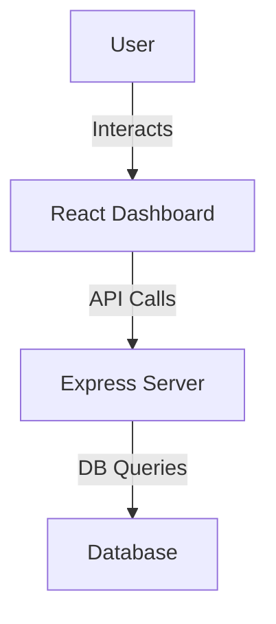

# Project Analysis: WinkWebhook

## Overview

This project consists of a backend (Node.js/Express) and a frontend (React, Vite) for managing webhooks, rules, and dashboards. The structure is divided into two main parts:
- **Backend**: Handles API endpoints, database operations, and server logic.
- **Frontend**: Provides a modern dashboard UI for interacting with the backend.

---

## Backend Structure

### Main Files
- **server.js**: Entry point for the backend server. Sets up Express, routes, and middleware.
- **database.js**: Handles database connections and queries (likely using SQLite or similar, based on naming).
- **package.json**: Lists backend dependencies (e.g., Express, CORS, body-parser).

### Responsibilities
- **API Endpoints**: Serve data to the frontend, handle CRUD operations for rules/pages/webhooks.
- **Database Layer**: Abstracts data storage and retrieval.
- **Middleware**: Handles CORS, JSON parsing, and possibly authentication.

### Notable Patterns
- **Separation of Concerns**: Database logic is separated from server logic.
- **RESTful API**: Likely exposes endpoints for rules, pages, and dashboard data.

---

## Frontend Structure

Located in the `dashboard-react/` folder, built with React and Vite for fast development and hot reloading.

### Main Files & Folders
- **src/**: Main source code for the React app.
  - **App.jsx**: Root component, sets up routing and layout.
  - **main.jsx**: Entry point, renders the app.
  - **assets/**: Static assets (images, icons, etc.).
  - **components/**: Reusable UI components.
    - **Modal/**: Modal dialog component.
    - **Navbar/**: Top navigation bar.
    - **PageCard/**: Card component for displaying pages.
    - **RulesTable/**: Table for displaying rules.
    - **Toast/**: Notification/toast messages.
  - **sections/**: Page-level sections.
    - **PagesSection.jsx**: Section for managing/viewing pages.
    - **RulesSection.jsx**: Section for managing/viewing rules.
- **public/**: Static files served directly (e.g., favicon, manifest).
- **index.html**: Main HTML template.
- **vite.config.js**: Vite configuration.
- **eslint.config.js**: Linting rules.
- **package.json**: Frontend dependencies (React, Vite, etc.).

### Responsibilities
- **UI/UX**: Provides a dashboard for users to manage webhooks, rules, and pages.
- **API Integration**: Fetches data from the backend and displays it.
- **State Management**: Likely uses React state/hooks for managing UI state.

### Notable Patterns
- **Component-Based Architecture**: UI is broken into reusable components.
- **Sectioned Layout**: Logical separation between different dashboard areas (rules, pages).
- **CSS Modules**: Scoped CSS for each component/section.

---

## Backend-Frontend Interaction

- **API Calls**: The frontend communicates with the backend via HTTP requests (likely using fetch or axios).
- **Data Flow**: User actions in the dashboard trigger API calls, which update the backend and reflect changes in the UI.

---

## Unique/Complex Logic
- **Rules Engine**: The presence of `RulesTable` and `RulesSection` suggests a rules management system, possibly with custom logic for evaluating or triggering webhooks.
- **Modal/Toast Components**: Custom UI for user feedback and interaction.

---

## High-Level Architecture Diagram

---

## Summary Table

| Layer     | Technology         | Key Files/Folders         | Responsibilities                |
|-----------|--------------------|---------------------------|----------------------------------|
| Backend   | Node.js, Express   | server.js, database.js    | API, DB, business logic          |
| Frontend  | React, Vite        | dashboard-react/src/      | UI, API integration, state mgmt  |
| Database  | (Unspecified)      | database.js               | Data storage/retrieval           |

---

## Recommendations
- **Add Documentation**: Inline code comments and API docs would help future maintainers.
- **Testing**: Consider adding unit/integration tests for both backend and frontend.
- **Environment Variables**: Use `.env` files for configuration (if not already present).

---

## Conclusion

This project is a well-structured full-stack application with clear separation between backend and frontend. It leverages modern tools (React, Vite, Express) and follows best practices for modularity and maintainability. The dashboard UI and rules management features are central to its functionality.
